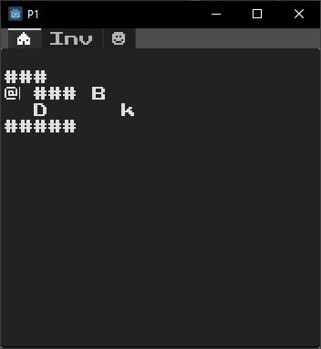
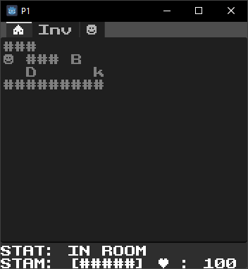

# rlreddit roguelike tutorial project by KN
 Godot 4 multiplayer in a roguelike.

## Day 1 / Week 1
 
Week 1 Summary: I'm still tinkering away at 2021's r/rldev's entry 'DUBD', but wanted a refresher so I'm back! Now I'm utilizing what's possible with Godot 4 and what I learned from Copyfrog and the Electric City and making a local multiplayer RL with the inspiration of Selina Dev. The game is still turn based, but upon moving the world comes alive (or will), each player will have 5 stamina pips per round to use: allowing them to move fast in spurts and then slowly at the pace of the slowest or most burdened player. Not sure how fun this will be in practice, will need to get some players.

Currently implemented:
1. Movement
2. Stamina
3. UI Basics
   
Working on:
1. Multiplayer with multiple keyboard and controller players.
2. Exiting the starter room
3. Dungeon Generation
